<div align="center">

# Modern Clinic Neumorphism Dashboard

### Dr. Marcus Johnson Clinical Suite — Soft Pastel Neumorphism Healthcare Workspace

[](https://react.dev/)
[](https://www.typescriptlang.org/)
[](https://vite.dev/)
[](https://tailwindcss.com/)
[](https://recharts.org/)
[](https://motion.dev/)
[](https://lucide.dev/)
[](docs/PRIVACY_AND_DATA_POLICY.md)
[](LICENSE)

**A modern, print-ready, multi-theme clinical dashboard crafted with soft pastel neumorphism, live Recharts vitals telemetry, schedule-synced clinical reminders, and instant filtered CSV export.**

[Explore Features](#public-modules--feature-matrix) · [Visual Gallery (25 Optimized Previews)](#visual-showcase-gallery-25-optimized-previews) · [Architecture](#system-architecture--infographics) · [Quick Start](#quick-start--how-to-use) · [Policies & Licensing](#policies-ui-design-protection--licensing)

<br/>

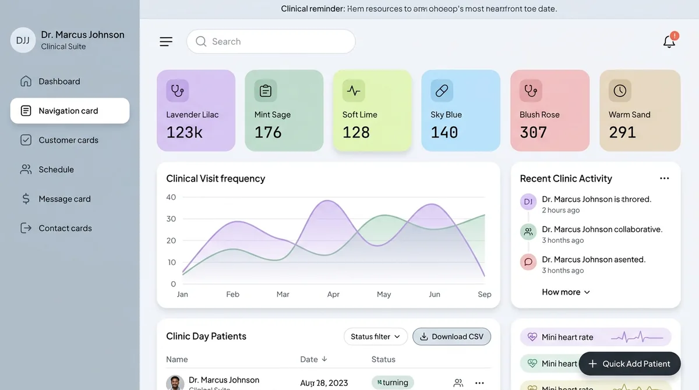

</div>

---

## Table of Contents

1. [What Is This Project?](#what-is-this-project)
2. [Documentation Micro-Files Index](#documentation-micro-files-index)
3. [Public Modules & Feature Matrix](#public-modules--feature-matrix)
4. [Visual Showcase Gallery (25 Optimized Previews)](#visual-showcase-gallery-25-optimized-previews)
5. [System Architecture & Infographics](#system-architecture--infographics)
6. [Tech Stack & Tools](#tech-stack--tools)
7. [Micro Code Previews](#micro-code-previews)
8. [Quick Start & How to Use](#quick-start--how-to-use)
9. [Keyboard Shortcuts Reference](#keyboard-shortcuts-reference)
10. [Policies, UI Design Protection & Licensing](#policies-ui-design-protection--licensing)
11. [Author Credits & Official References](#author-credits--official-references)

---

## What Is This Project?

**Modern Clinic Neumorphism Dashboard** (`modern-clinic-neumorphism-dashboard`) is a public, production-structured frontend showcase for outpatient clinical practice management (**Dr. Marcus Johnson Clinical Suite**). It demonstrates how dense medical workflows—daily OPD rosters, longitudinal patient profiles, blood pressure & heart-rate trends, master drug formularies, prescription shortcuts, certificates, and print-ready clinical reports—can live inside a calm, zero-clutter **Soft Pastel Neumorphism** interface.

### Core Engineering Highlights

- **Whisper-Soft Pastel Neumorphism & 7 Clinical Themes**: 5 light themes (`Sky Blue`, `Neon Modern Blue`, `Bone White Blue`, `Eco Green`, `Cherry Red`) and 2 calm, zero-glare dark themes (`Midnight Clinical`, `Night Galaxy`).
- **Schedule-Synced Clinical Reminders**: Top header alert banner and interactive Bell notification overlay dynamically surfacing alerts such as `Upcoming Appointment in 10 minutes` and `Urgent Lab Report Pending` from the active clinic date's schedule.
- **Inline Vitals Sparklines & Longitudinal Charts**: Recharts 6-month visit frequency line graphs, per-patient inline HR/BP sparklines, and multi-series historical BP + weight visualizations.
- **Print-Optimized Clinical Vitals Reports**: Dedicated `@media print` rules format tabular Blood Pressure, MAP, Pulse, and Classification tables cleanly for paper clinical records while hiding navigation chrome.
- **Instant Filtered CSV Exports**: RFC-4180 compliant, UTF-8 BOM encoded CSV downloads directly from the Dashboard filtered patient list and Data Explorer views.
- **Rapid Walk-In Onboarding**: Floating `Quick Add Patient` action button with minimal validated fields (`Name`, `Age`, `Phone`) that immediately updates the live OPD queue and persists locally.
- **Silky Ergonomics**: 3-line hamburger to red-pink `X` menu toggle, 0.8-second contextual shimmer page skeletons, smooth scrolling, toast notifications, and full global keyboard navigation.

---

## Documentation Micro-Files Index

This repository organizes deep engineering specifications, usage terms, and policies into modular documentation files:

| Document | Scope & Contents |
|---|---|
| [`POLICIES.md`](POLICIES.md) | **UI Design Protection Policy, Public Usage Terms, AI + Human Technical Stack (Google AI Studio, Gemini) & Permission Contact** |
| [`LICENSE`](LICENSE) | **Custom Source-Available Public Preview License (All Rights Reserved)** |
| [`docs/ARCHITECTURE.md`](docs/ARCHITECTURE.md) | Layered architecture, component graph, Mermaid sequence diagrams, and full source tree |
| [`docs/FEATURES_AND_MODULES.md`](docs/FEATURES_AND_MODULES.md) | Deep walkthrough of every public clinical screen and interactive workflow |
| [`docs/DESIGN_SYSTEM.md`](docs/DESIGN_SYSTEM.md) | Soft Pastel Neumorphism elevation tokens, 7-theme palette matrix, curves, and typography |
| [`docs/TECH_STACK_AND_TOOLS.md`](docs/TECH_STACK_AND_TOOLS.md) | Complete library inventory, build/lint commands, and AI + human tooling breakdown |
| [`docs/USAGE_AND_SHORTCUTS.md`](docs/USAGE_AND_SHORTCUTS.md) | Step-by-step installation, workflow guides, keyboard hotkeys, and print instructions |
| [`docs/PRIVACY_AND_DATA_POLICY.md`](docs/PRIVACY_AND_DATA_POLICY.md) | Synthetic preview data guarantee and `.gitignore` private-data isolation rules |

---

## Public Modules & Feature Matrix

> Only public-facing clinical workflow modules are showcased below. Private administrative backends, live clinic databases, and production API credentials are excluded from this repository.

| Public Module | Route Key | Primary Capabilities |
|---|---|---|
| **Clinical Overview** | `dashboard` | 6 pastel KPI tiles, OPD completion ring, 6-month Recharts visit trend, Recent Clinic Activity, Clinic Day Patients with Status Filter, HR/BP Sparklines, Download CSV, and Quick Add Patient FAB |
| **Header Reminders System** | Global Header | Dismissible top clinical reminder banner (`Upcoming Appointment in 10 minutes`, `Urgent Lab Report Pending`), Bell overlay popover, instant chart navigation, and global Print Current View |
| **Today's Clinic OPD** | `today` | Active clinic date consultation queue, vitals triage summary, decoded dosage prescription preview, and print sheet |
| **Clinic Schedule Calendar** | `calendar` | Interactive monthly outpatient calendar with encounter density pills and one-click date jump |
| **Patients Directory** | `search` | Instant multi-field ranked search across 43,488+ synthetic preview profiles by Serial `#`, Name, Guardian, Phone, or Locality |
| **Patient Profile & Vitals Modal** | Modal Overlay | Historical BP & Weight Recharts trend graph, print-ready Vitals Summary table (BP, MAP, Pulse, Classification), and chronological visit ledger |
| **Medicines Master Formulary** | `medicines` | Searchable 73-drug catalog with trade names, generic chemical salts, therapeutic badges, and caution notes |
| **Clinical Rx Shortcuts** | `shortcuts` | 357 structured prescription shorthand templates organized by specialty |
| **Medical Certificates** | `certificates` | Fitness, leave, duty resumption, and immunization certificate registry |
| **Cashbook Journal** | `cashbook` | Daily OPD consultation fee ledger and reconciliation summary |
| **Clinical Analytics & Reports** | `reports` | Calendar date-range picker, 26+ clinical trend charts, diagnostic mix donut, and age cohort analytics |
| **Settings & Theme Studio** | `settings` | 7-theme live switcher, vertical/horizontal nav mode, sidebar appearance, and clinic profile preferences |

---

## Visual Showcase Gallery (25 Optimized Previews)

> All raster screenshots are optimized to lightweight **WebP** (`1200px` wide, 82% quality, `37–58 KB` each) paired with XML-validated vector specs (`5–11 KB` each) for fast, crisp GitHub loading (~521 KB total across all 25 visuals).

### Part A — Primary Application Views (9 Lightweight WebP Previews)

| 01. Overview Dashboard (Soft Light Mode) | 02. Clinical Analytics & Reports (Calm Dark Mode) |
|---|---|
|  | 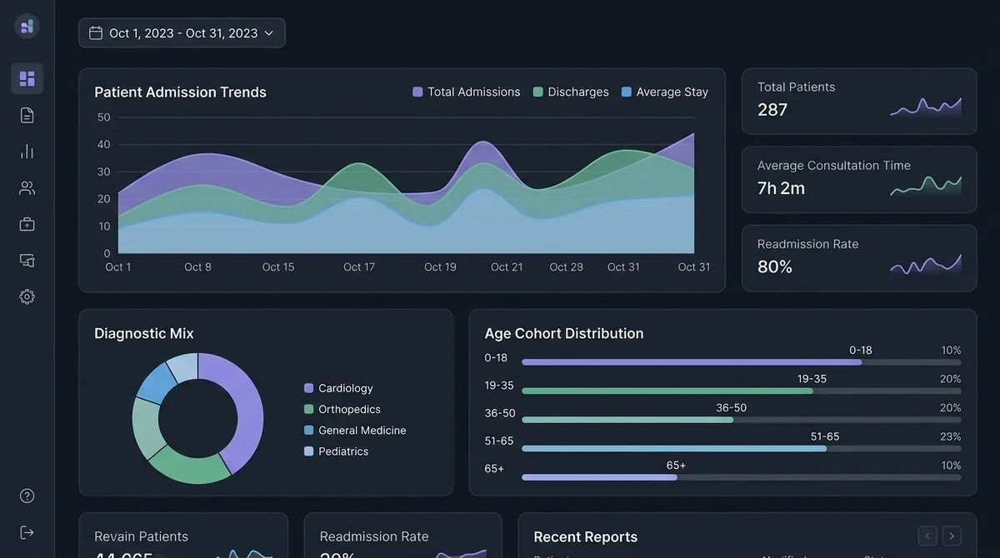 |
| **6 Pastel KPI Cards, 6-Month Visit Chart, Activity Feed & Patient Queue** | **Date-Range Filter, Multi-Series Recharts & High-Contrast Dark Surfaces** |

| 03. Longitudinal Patient Profile & Vitals Modal | 04. Clinic Schedule Calendar & Master Formulary |
|---|---|
| 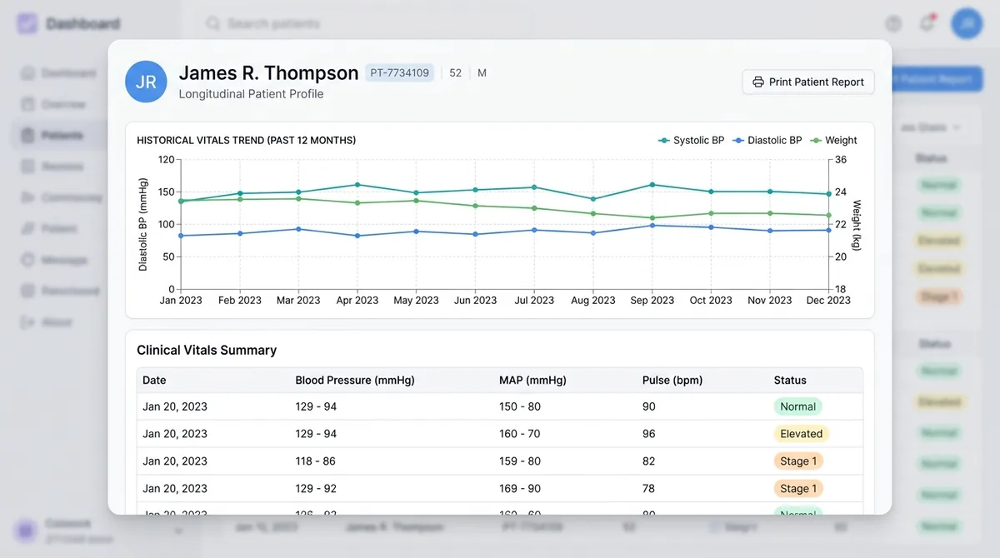 | 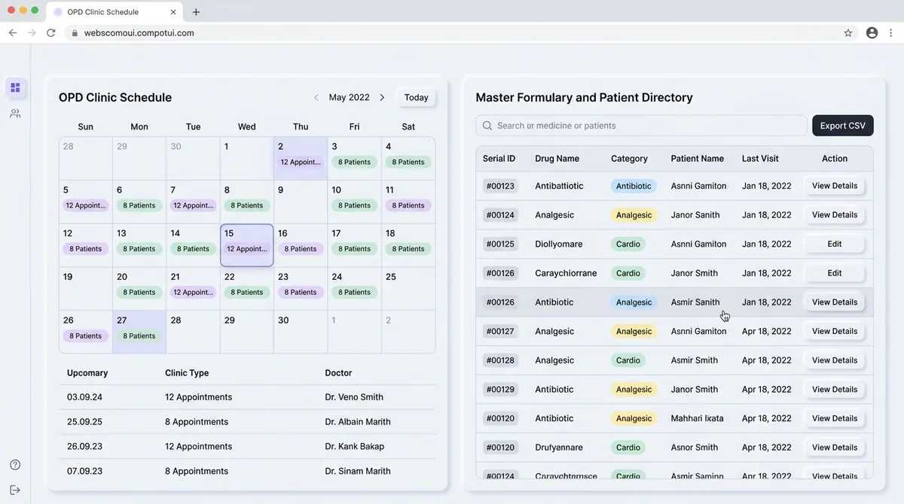 |
| **Historical BP/Weight Line Chart + Print-Optimized Vitals Summary Table** | **Monthly OPD Encounter Calendar + Searchable 73-Drug Catalog** |

| 05. Today's Clinic OPD Queue & Rx Detail | 06. Master Formulary & Patients Directory |
|---|---|
| 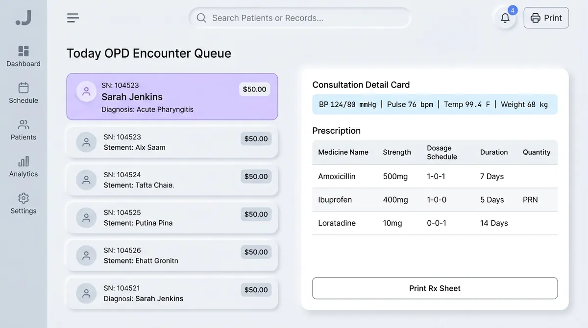 | 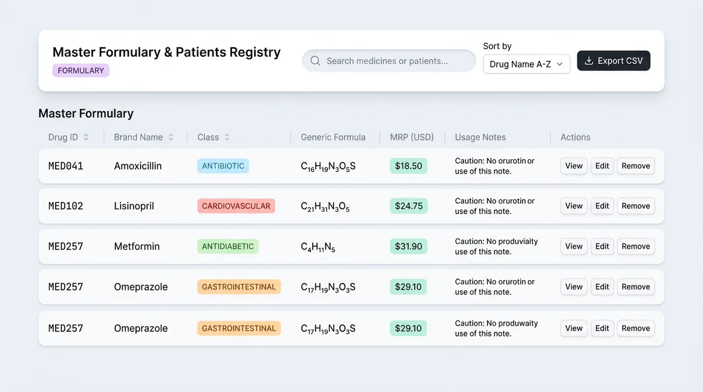 |
| **Active Outpatient Roster, Vitals Strip & Decoded Prescription Preview** | **Searchable Drug Registry with Therapeutic Badges & Export CSV** |

| 07. Reminders Banner, Bell Overlay & Quick Add Modal | 08. Settings & 7-Theme Appearance Studio |
|---|---|
| 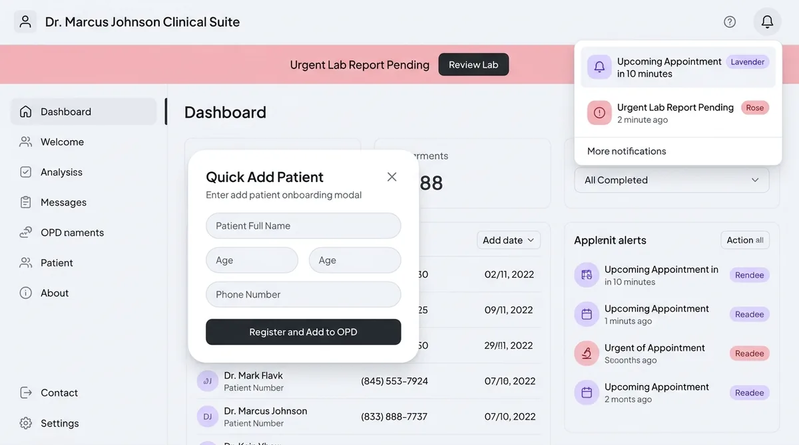 | 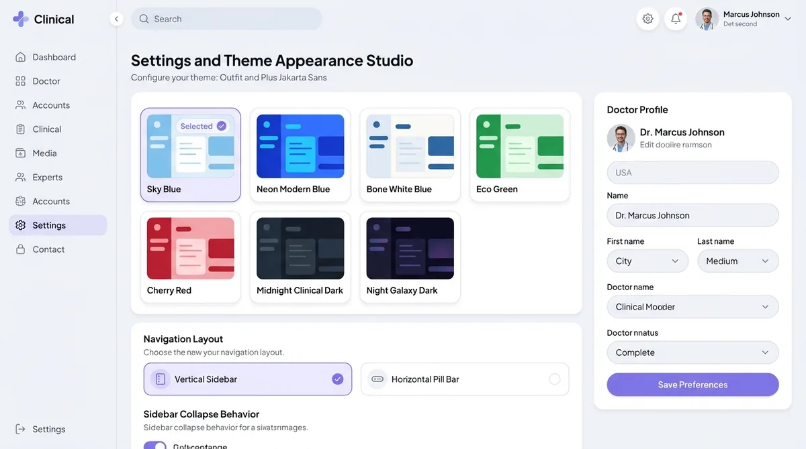 |
| **Schedule-Synced Clinical Alerts + Minimal Walk-In Onboarding Modal** | **7 Live Clinical Themes, Layout Orientation & Doctor Profile Controls** |

<div align="center">

#### 09. Soft-UI Neumorphism Component Pattern Sheet

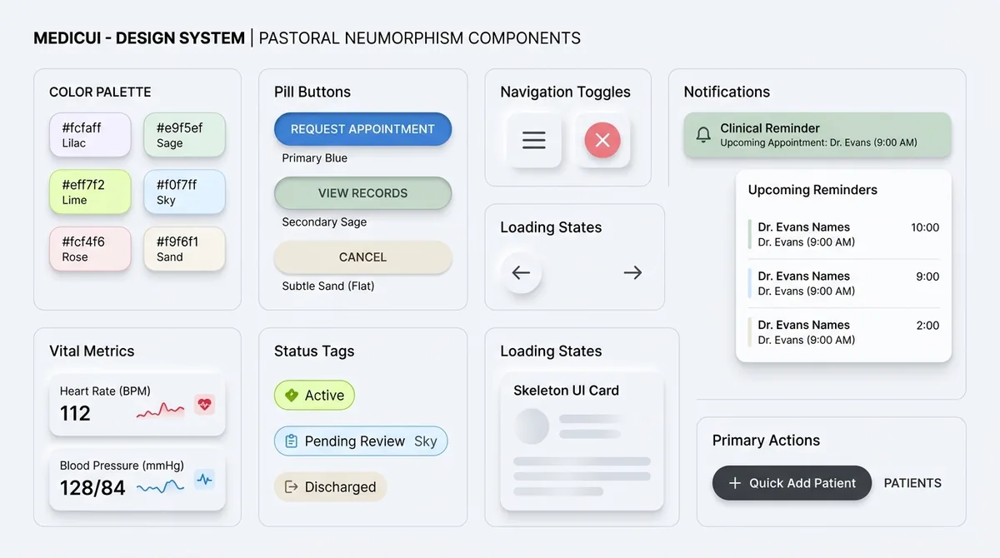

</div>

---

### Part B — Interactive Feature & UI Pattern Specs (16 Crisp Vector Previews)

| 10. Header Clinical Reminders Banner & Overlay | 11. Quick Add Patient FAB & Onboarding Modal |
|---|---|
| 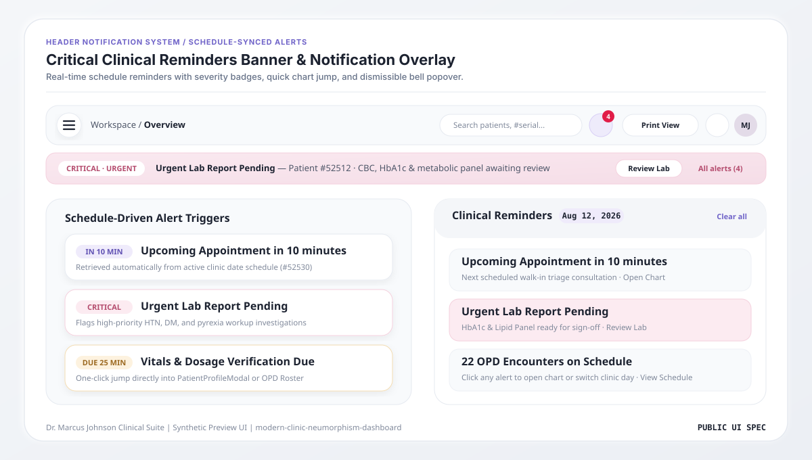 |  |

| 12. Patient Status Filter, Mini Sparklines & CSV | 13. 3-Line Menu Toggle, Icon Rail & Horizontal Nav |
|---|---|
|  |  |

| 14. 7-Theme Clinical Token Matrix | 15. Today's Clinic OPD Queue & Rx Preview |
|---|---|
| 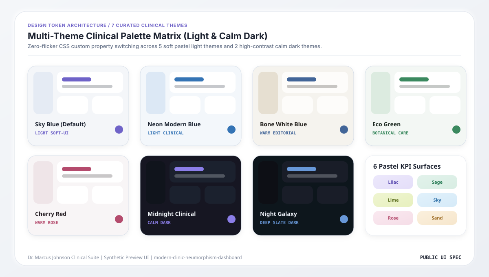 |  |

| 16. 43k+ Longitudinal Patient Directory Search | 17. Clinical Rx Shortcuts Matrix (357 Codes) |
|---|---|
|  |  |

| 18. Medical Certificates & Daily Cashbook | 19. Print-Optimized Clinical Report (`@media print`) |
|---|---|
| 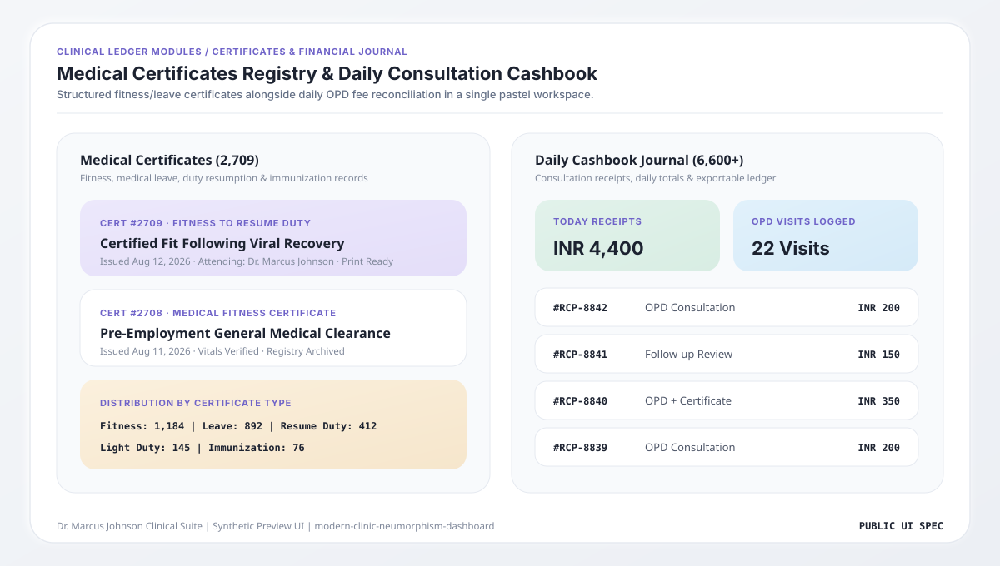 | 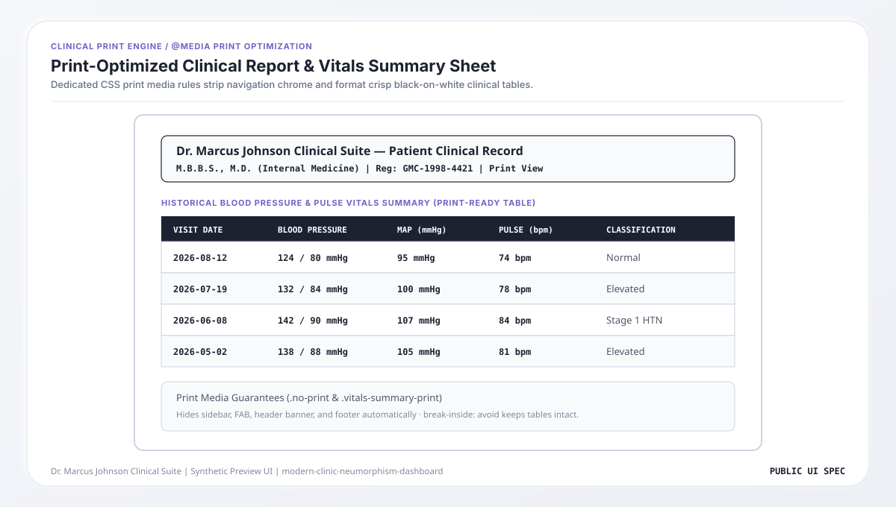 |

| 20. 0.8s Shimmer Skeletons, Toasts & Hotkeys | 21. Architecture & Privacy Isolation Infographic |
|---|---|
|  | 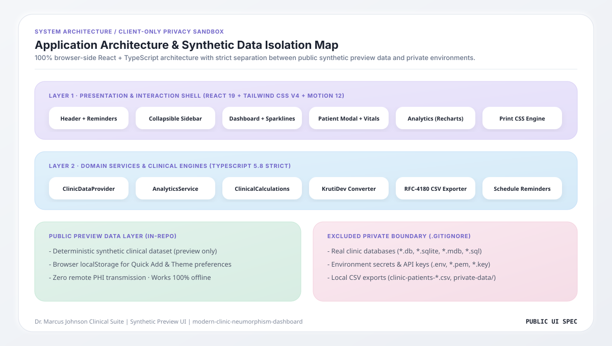 |

| 22. Synthetic Data Health & Lineage Diagnostics | 23. Interactive Data Explorer & Multi-Table CSV |
|---|---|
| 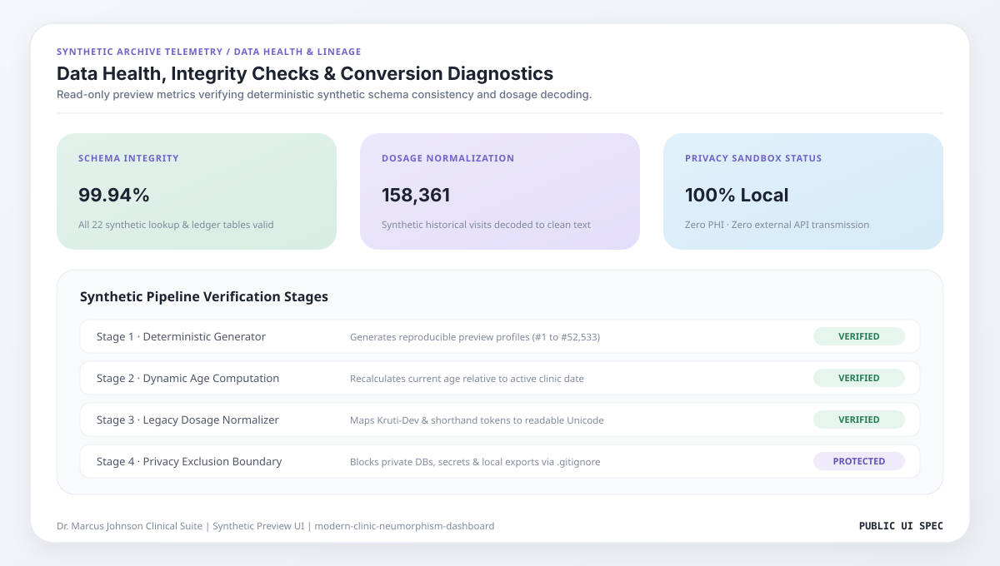 | 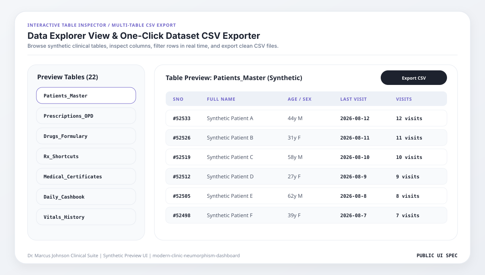 |

| 24. Responsive Ergonomics (Desktop, Tablet, Mobile) | 25. Walkthrough Modal, Policies & Compact Footer |
|---|---|
| 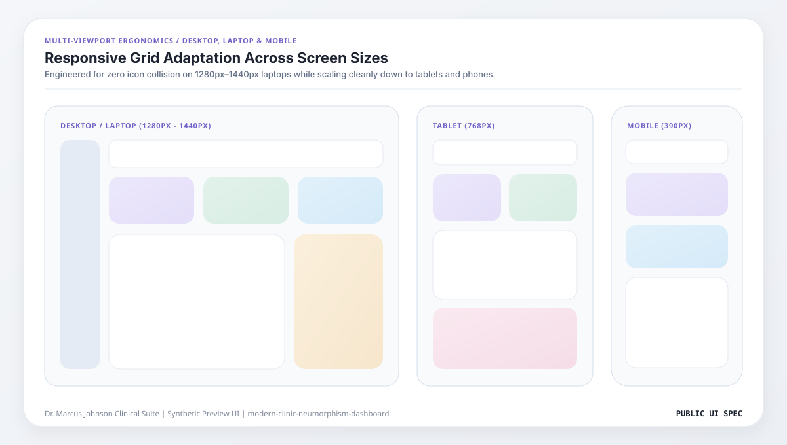 | 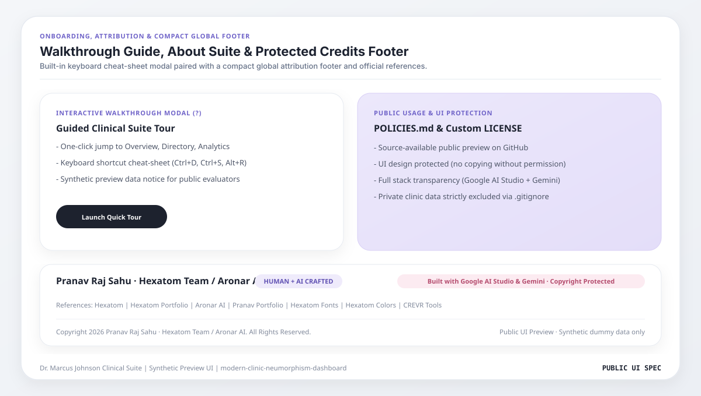 |

---

## System Architecture & Infographics

### High-Level Component & Data Isolation Flow

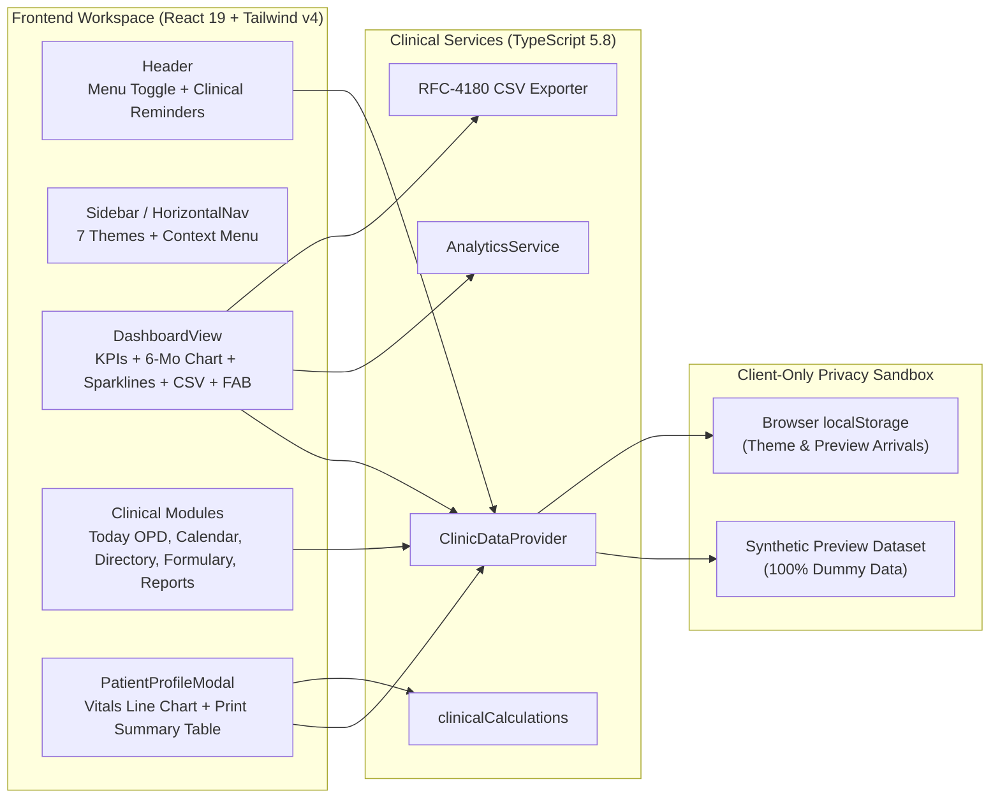
```mermaid
flowchart LR
  subgraph UI["Frontend Workspace (React 19 + Tailwind v4)"]
    H["Header\nMenu Toggle + Clinical Reminders"]
    S["Sidebar / HorizontalNav\n7 Themes + Context Menu"]
    D["DashboardView\nKPIs + 6-Mo Chart + Sparklines + CSV + FAB"]
    V["Clinical Modules\nToday OPD, Calendar, Directory, Formulary, Reports"]
    M["PatientProfileModal\nVitals Line Chart + Print Summary Table"]
  end

  subgraph Engine["Clinical Services (TypeScript 5.8)"]
    DP["ClinicDataProvider"]
    AN["AnalyticsService"]
    CALC["clinicalCalculations"]
    CSV["RFC-4180 CSV Exporter"]
  end

  subgraph Sandbox["Client-Only Privacy Sandbox"]
    SYN["Synthetic Preview Dataset\n(100% Dummy Data)"]
    LS["Browser localStorage\n(Theme & Preview Arrivals)"]
  end

  H --> DP
  D --> DP
  D --> AN
  D --> CSV
  V --> DP
  M --> DP
  M --> CALC
  DP --> SYN
  DP --> LS
```

### Clinical Interaction Lifecycle

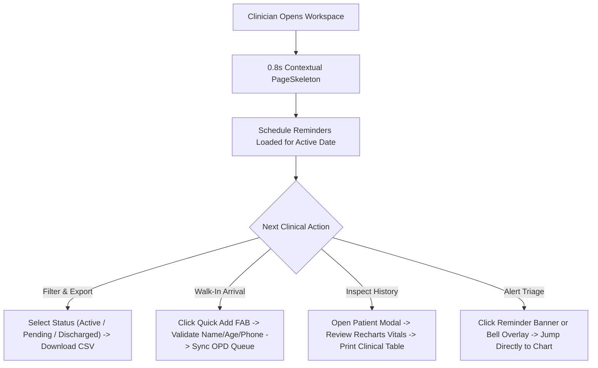
```mermaid
flowchart TD
  A["Clinician Opens Workspace"] --> B["0.8s Contextual PageSkeleton"]
  B --> C["Schedule Reminders Loaded for Active Date"]
  C --> D{"Next Clinical Action"}
  D -->|"Filter & Export"| E["Select Status (Active / Pending / Discharged) -> Download CSV"]
  D -->|"Walk-In Arrival"| F["Click Quick Add FAB -> Validate Name/Age/Phone -> Sync OPD Queue"]
  D -->|"Inspect History"| G["Open Patient Modal -> Review Recharts Vitals -> Print Clinical Table"]
  D -->|"Alert Triage"| H["Click Reminder Banner or Bell Overlay -> Jump Directly to Chart"]
```

For full sequence diagrams and directory specifications, see [`docs/ARCHITECTURE.md`](docs/ARCHITECTURE.md).

---

## Tech Stack & Tools

| Layer | Technology | Version | Purpose |
|---|---|---|---|
| **AI + Human Platform** | Google AI Studio & Gemini | Build / API | Collaborative UI architecture, prototyping & workflow synthesis |
| **UI Core** | React + React DOM | `19.0.1` | Modular functional components, hooks, strict rendering |
| **Type Safety** | TypeScript | `~5.8.2` | Strict clinical models (`PatientRecord`, `PrescriptionRecord`, `ClinicSettings`) |
| **Build Engine** | Vite | `6.2.3` | Instant dev server on port 3000 and fast production bundling |
| **Design System** | Tailwind CSS v4 | `4.1.14` | Utility classes combined with 7-theme semantic CSS variables |
| **Charts & Telemetry** | Recharts | `3.10.1` | 6-month visit trends, patient vitals charts, and inline HR/BP sparklines |
| **Animation** | Motion (`motion/react`) | `12.23.24` | Smooth `AnimatePresence` page transitions, alert overlays, and FAB springs |
| **Iconography** | Lucide React | `0.546.0` | Clean, uniform stroke vector iconography with zero raw emojis |
| **Fonts** | Outfit, Plus Jakarta Sans, JetBrains Mono | Web Fonts | Editorial display headings, crisp UI copy, and tabular clinical figures |

---

## Micro Code Previews

### 1. Schedule-Driven Critical Clinical Reminders (`src/services/dataProvider.ts`)

```ts
export function getScheduleAlerts(dateStr: string) {
  const reminders = ClinicDataProvider.getClinicalReminders(dateStr);
  // Returns structured reminders derived from the active clinic date:
  // - "Upcoming Appointment in 10 minutes" (linked to next patient serial)
  // - "Urgent Lab Report Pending" (linked to chronic/workup encounter)
  // - "Vitals & Dosage Verification Due"
  // - Daily OPD schedule summary
  return reminders;
}
```

### 2. RFC-4180 Filtered Patient CSV Export (`src/views/DashboardView.tsx`)

```ts
const escapeCsvCell = (value: string | number | null | undefined): string => {
  const str = value === null || value === undefined ? '' : String(value);
  return /[",\r\n]/.test(str) ? `"${str.replace(/"/g, '""')}"` : str;
};

// Exports ALL records matching selectedScheduleDate + patientStatusFilter
const csvContent = '\uFEFF' + [headers.map(escapeCsvCell).join(','), ...rows].join('\r\n');
const blob = new Blob([csvContent], { type: 'text/csv;charset=utf-8;' });
```

### 3. Soft Pastel Neumorphism CSS Token Pattern (`src/index.css`)

```css
:root,
[data-theme="sky-blue"] {
  --bg-primary: #f4f6f9;
  --sidebar-bg: linear-gradient(180deg, #e9eef5 0%, #e1e8f1 100%);
  --kpi-lilac-bg: linear-gradient(140deg, #ece8fb 0%, #e4def9 100%);
  --kpi-sage-bg: linear-gradient(140deg, #e2f2eb 0%, #d8ede3 100%);
  --neu-raised: 0 8px 24px rgba(32, 42, 64, 0.055), -3px -3px 12px rgba(255, 255, 255, 0.85);
}
```

---

## Quick Start & How to Use

### Prerequisites

- **Node.js** `v18.18+` or `v20+`
- **npm** `v9+` (or `bun` / `pnpm`)

### Installation & Local Run

```bash
# Clone the public repository
git clone https://github.com/aarushxox/modern-clinic-neumorphism-dashboard.git
cd modern-clinic-neumorphism-dashboard

# Install packages
npm install

# Start development server at http://localhost:3000
npm run dev
```

### Verification Commands

```bash
# TypeScript static type check
npm run lint

# Production Vite build
npm run build

# Preview production build
npm run preview
```

---

## Keyboard Shortcuts Reference

| Hotkey | Action |
|---|---|
| `Ctrl + D` / `Alt + D` | Open **Overview Dashboard** |
| `Ctrl + S` / `Alt + S` | Open **Patients Directory** |
| `Ctrl + T` / `Alt + T` | Open **Today's Clinic OPD** |
| `Ctrl + M` / `Alt + M` | Open **Medicines Master Formulary** |
| `Ctrl + K` / `Alt + K` | Open **Clinical Rx Shortcuts** |
| `Alt + C` / `Alt + J` / `Alt + R` | Open **Certificates**, **Cashbook**, or **Analytics** |
| `Ctrl + ,` / `Alt + P` | Open **Settings & Themes** |
| `Ctrl + /` | Toggle **Walkthrough & Shortcut Modal** |
| `Esc` | Dismiss active modal or Clinical Reminders overlay |

---

## Policies, UI Design Protection & Licensing

> **IMPORTANT PUBLIC USAGE & PROTECTION POLICY:**
> Please read **[`POLICIES.md`](POLICIES.md)** and **[`LICENSE`](LICENSE)** before reusing any portion of this repository.

- **Protected UI Design (Custom Source-Available Public Preview License)**: This repository is publicly viewable for inspection, learning, and local preview, **not** licensed under permissive MIT or Apache-2.0 copying terms. Copying, cloning, rebranding, or redistributing the UI design, layouts, or source code requires prior written permission from **Pranav Raj Sahu (Hexatom Team / Aronar AI)**.
- **Full Technical Stack & AI + Human Disclosure**: Detailed in **[`POLICIES.md`](POLICIES.md)**, covering **Google AI Studio**, **Gemini**, React 19, TypeScript 5.8, Vite 6, Tailwind CSS v4, Recharts 3, Motion 12, and Lucide React.
- **Synthetic Preview Data Guarantee**: All clinical profiles, vitals, encounters, and ledgers bundled in this repo are **100% synthetic dummy data** strictly for preview. Private databases (`*.db`, `*.sqlite`, `*.mdb`, `*.sql`), `.env*` secrets, and local CSV exports are blocked by `.gitignore` (see [`docs/PRIVACY_AND_DATA_POLICY.md`](docs/PRIVACY_AND_DATA_POLICY.md)).

---

## Author Credits & Official References

**Engineered & Curated by Pranav Raj Sahu — Hexatom Team / Aronar AI**

| Platform / Project | Official Link | Category |
|---|---|---|
| **GitHub Repository** | [github.com/aarushxox/modern-clinic-neumorphism-dashboard](https://github.com/aarushxox/modern-clinic-neumorphism-dashboard) | Source Code |
| **Policies & Licensing** | [`POLICIES.md`](POLICIES.md) · [`LICENSE`](LICENSE) | Usage Terms |
| **Hexatom** | [hexatom-org.vercel.app](https://hexatom-org.vercel.app/) | Agency |
| **Hexatom Portfolio** | [hexatom.imaginefuture1-7.workers.dev](https://hexatom.imaginefuture1-7.workers.dev/) | Showcase |
| **Aronar AI** | [aronar-ai.vercel.app](http://aronar-ai.vercel.app/) | AI Venture |
| **Pranav Sahu Portfolio** | [pranav005-portfolio.netlify.app](https://pranav005-portfolio.netlify.app/) | Founder |
| **Hexatom Fonts** | [the-fonts-hexatom.pranavsahu005.workers.dev](https://the-fonts-hexatom.pranavsahu005.workers.dev/) | Typography Tool |
| **Hexatom Colors** | [hexatom-the-colors.base44.app](https://hexatom-the-colors.base44.app/) | Color System Tool |
| **CREVR Media Flow** | [crevr-media-flow.base44.app](https://crevr-media-flow.base44.app/) | CREVR Tool |
| **CREVR Studio App** | [crevr-807931817037.asia-southeast1.run.app](https://crevr-807931817037.asia-southeast1.run.app/) | CREVR Tool |
| **CREVR Tree** | [crevr-tree.vercel.app](https://crevr-tree.vercel.app/) | CREVR Links |

---

<div align="center">

Copyright &copy; 2026 **Pranav Raj Sahu** · **Hexatom Team / Aronar AI**. All Rights Reserved.
Built with Human Engineering + Google AI Studio, Gemini & API Tooling.

</div>
